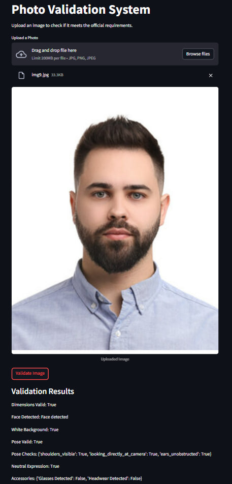

# Photo Validation System

The **Photo Validation System** is an automated tool designed to validate ID photos against official requirements. It ensures that uploaded images meet specific criteria, such as correct dimensions, neutral expression, white background, proper face positioning, and absence of accessories like glasses or headwear.

## Features

**Face Detection** – Ensures a face is present in the image.

**Dimension Validation** – Ensures the image size is exactly **413x531 pixels**.

**Background Check** – Confirms the background is white.

**Expression Analysis** – Checks for a neutral expression (no smiling or teeth showing).

**Pose Estimation** – Verifies direct gaze, visible shoulders, and unobstructed ears.

**Accessory Detection** – Identifies whether glasses or headwear are present.

---

## **Setup & Installation**

### **Clone the Repository**

```bash
git clone <repository-url>
cd vfs-task
```

### **Install Dependencies and Set Up API Key for Accessory Detection**

```bash
pip install -r requirements.txt

TOGETHER_API_KEY=your_api_key_here
```

### **Run the FastAPI Backend and Run the Streamlit Frontend**

```bash
uvicorn main:app --host 0.0.0.0 --port 8000

streamlit run app.py
```

- API will be available at http://127.0.0.1:8000/.
- The interface will open, allowing users to upload images for validation.

## Overview of the Approach

The **Photo Validation System** follows a modular approach, leveraging computer vision and machine learning models to validate images based on official ID photo requirements. The system performs the following checks:

- **Face Detection**: Identifies whether a face is present.
- **Dimension Validation**: Ensures the image is exactly **413x531 pixels**.
- **Background Check**: Ensures the background is white.
- **Pose Estimation**: Checks if the subject is looking directly at the camera with visible shoulders and unobstructed ears.
- **Expression Analysis**: Ensures a neutral expression (no smiling or teeth showing).
- **Accessory Detection**: Identifies whether glasses or headwear are present.

### **Technology Stack**

- **FastAPI** – Backend framework
- **Streamlit** – Frontend for user interaction
- **OpenCV** – Image processing
- **MTCNN (FaceNet-PyTorch)** – Face detection
- **RetinaFace** – Background validation
- **DeepFace** – Expression analysis
- **MediaPipe** – Pose estimation
- **Meta-Llama 3.2 Vision Model** – Accessory detection (temporary solution)

### Example Test Case of Photo Validation System



## Description of Components & How They Work Together

### **1️. Face Detection (`face_detection.py`)**

- Uses **MTCNN** to detect faces.
- If no face is detected, validation fails.

### **2️. Background Check (`background_check.py`)**

- Uses **OpenCV + RetinaFace** to identify if the background is white.
- Faces are masked out before calculating the white background ratio.

### **3️. Pose Estimation (`pose_estimation.py`)**

- Uses **MediaPipe** to verify:
  - **Looking directly at the camera**
  - **Shoulders are visible**
  - **Ears are unobstructed**
- If any of these checks fail, the validation fails.

### **4️. Expression Analysis (`expression_check.py`)**

- Uses **DeepFace** to analyze the dominant emotion.
- Only **neutral expressions** pass.

### **5️. Dimension Validation (`dimension_check.py`)**

- Uses **OpenCV** to check if the image is **413x531 pixels**.
- If dimensions do not match, validation fails.

### **6️. Accessory Detection (`accessory_check.py`)**

- **Originally planned as a computer vision (CV) approach** using object detection models.
- Due to accuracy issues, **Meta-Llama 3.2 (Vision-Language Model) was used instead**.
- Future improvements involve **fine-tuning a dedicated YOLOv8 model** to replace this approach.

## Known Limitations

### 1. Computer Vision-Based Accessory Detection Was Inaccurate

- **Issue:** The CV-based approach for accessory detection lacked precision.
- **Temporary Fix:** Used a Vision-Language Model (**Meta-Llama 3.2**) via the **Together API**.
- **Limitation:** External API dependency increases cost.

### 2. Background Validation Is Sensitive to Lighting

- **Issue:** The white background detection may fail under uneven lighting conditions.
- **Limitation:** If the lighting varies significantly, the **HSV threshold method** may not work reliably.

### 3. Processing Speed

- **Issue:** Some models (e.g., **MTCNN, RetinaFace**) are computationally expensive.
- **Limitation:** Slower validation times, especially for high-resolution images.

### 4. Handling Multiple Faces

- **Issue:** The system assumes a **single face** in the image.
- **Limitation:** If multiple faces are detected, it does not filter out irrelevant ones.

## Future Improvements (If Given More Time)

### 1. Improve Accessory Detection Without External APIs

- **Approach:** Fine-tune a **YOLOv8-based object detection model** for accessories.
- **Benefit:** Eliminates reliance on Vision-Language Models, reducing cost.

### 2. Enhance Background Validation

- **Approach:** Implement a **deep learning segmentation model (e.g., U-Net)**.
- **Benefit:** Improves robustness against varying lighting conditions.

### 3. Speed Optimization for Face & Pose Detection

- **Approach:** Convert models to **ONNX** runtime for optimized inference.
- **Benefit:** Reduces computation time without sacrificing accuracy.

### 4. Multi-Face Handling

- **Approach:** Process only the **largest detected face** when multiple faces are present.
- **Benefit:** Ensures validation remains focused on the correct subject.

### 5. Extend to Real-Time Validation

- **Approach:** Integrate a **streaming feature** for real-time validation.
- **Benefit:** Can be used in **live photo booths or online registration portals**.
